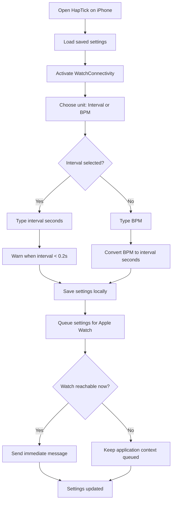
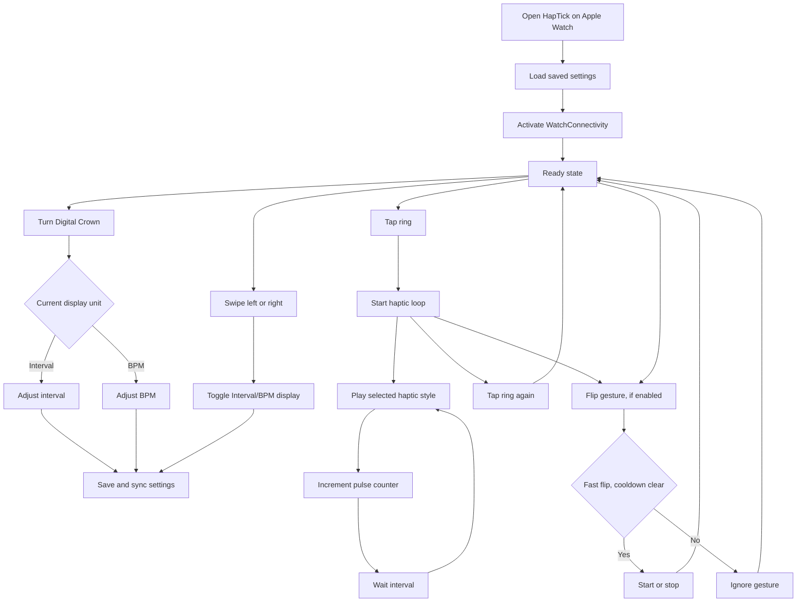
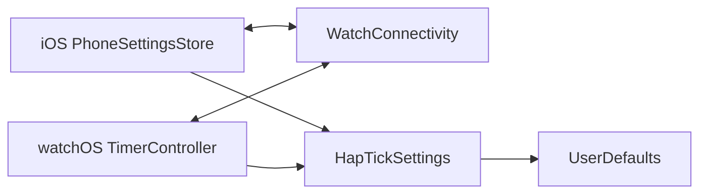

# HapTick App Flows

## iOS Companion

Purpose: edit the timer value, compose repeating haptic sequences, play on iPhone, and sync the same settings to Apple Watch.

Primary iOS screens:

1. iPhone playback controls (haptics run while the app is open)
2. Unit picker, showing either Interval input or BPM input
3. Composition toggle and ordered steps, labelled with style abbreviations
4. Haptic Style grid for single pulses and added steps
5. Watch start/stop controls and sync status
6. Watch flip-to-start/stop toggle

Key rules:

- The user edits either Interval or BPM, never both at the same time.
- Interval is the stored source of truth.
- BPM is converted to interval seconds before saving.
- `0.2s` is the global supported interval floor. Typed values below it stay visible and are shown as invalid instead of being clamped to `0.2s`.
- The global maximum BPM is derived from the interval floor: `60 / 0.2s = 300 BPM`.
- On Apple Watch, interval crown steps are `0.05s` below `1.5s`, then `0.1s` up to `15s`, `0.2s` up to `30s`, and `0.5s` after that.
- The app warns in red when a haptic style is probably too slow for the current interval, but does not clamp the value. Unsupported style choices are red, and only the selected style keeps a border.
- A composition contains 1–64 ordered steps. Each step can be changed, moved, duplicated, or removed; the last remaining step cannot be removed. Repeated styles share their actual abbreviation (for example `UP · CLK · SUC · CLK`).
- The interval is the time between step starts, including the final-to-first loop boundary. Speed validation covers every style in an enabled composition.
- Core Haptics schedules the iPhone composition as one looping pattern. Backgrounding the iPhone app stops playback.
- Chinese (Simplified and Traditional), Japanese, French, and Spanish cover both apps. Numeric input accepts the device locale's decimal separator.

## watchOS App

Purpose: start and stop a repeating haptic timer with minimal friction on Apple Watch.

Primary watchOS screens and states:

1. Centered timer ring
2. Ready state, showing `ready`
3. Running state, showing pulse count
4. Style grid below the ring
5. Saved composition toggle and abbreviation preview below the ring
6. Flip to start/stop toggle below the style grid
7. First-launch Digital Crown hint

Key rules:

- Tap the ring to start or stop.
- Turn the Digital Crown to edit the currently displayed unit.
- Swipe left or right to toggle Interval/BPM display.
- Flip only toggles after a successful fast flip, then waits through cooldown.
- Animation can pause when the watch is dimmed or not focused; haptics continue through the runtime session.

## Shared Settings Contract

Shared fields:

- `intervalSeconds`
- `hapticStyle`
- `motionToggleEnabled`
- `displayMode`
- `compositionEnabled`
- `composition` (ordered style raw values)

Legacy saved settings remain valid and default to single-style playback. Messages from older peers preserve composition fields already saved on the receiving device.
